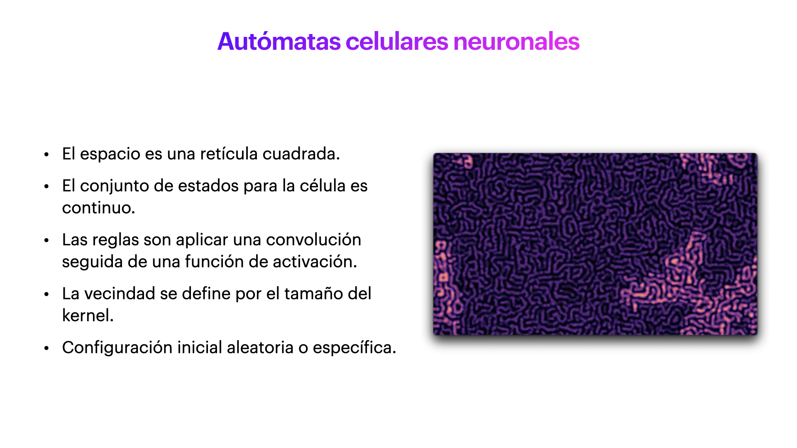

# Autómatas Celulares Neuronales

Los autómatas celulares (AC) permiten modelar una gran variedad de sistemas que pueden ser descritos por un conjunto de objetos simples que interactúan localmente entre ellos. Estos objetos se representan por su posición y por una serie de estados discretos. Sus interacciones se modelan por un conjunto de reglas bien definidas, donde la aplicación iterativa de estas reglas da como resultado comportamientos complejos.

En este proyecyo se propone dar algunos ejemplos de una variación de los AC, los autómatas celulares neuronales (ACN). En donde, a diferencia de los AC ''regulares'' los estados de cada objeto se representan por valores continuos, y el conjunto de reglas se sustituyen por la aplicación de una convolución discreta, seguida por alguna función de activación. Estas variaciones permiten que los ACN tengan comportamientos muy variados, desde logrando reproducir resultados de los AC ''regulares'', hasta obtener comportamientos muy parecidos a un sistema de reacción-difusión.

